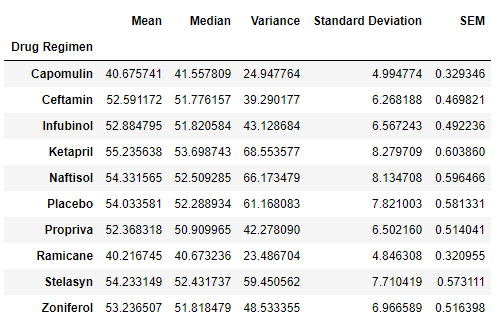

# Pymaceuticals Review

## Summary
This data analysis consists of results from a study of mice with tumors and the effect of different drug regimens on the volume of the tumors. The orignal data is saved in csv form in data directory. The data about each test subject is in mouse_metadata.csv and the results of the study is in Study_results.csv. You should be one directory ahead of the data directory in order to run the code correctly.

## Data analysis

The first part of the analysis was running a statistics summary on tumor volume across all drug regimens. The summary is pictured below.

